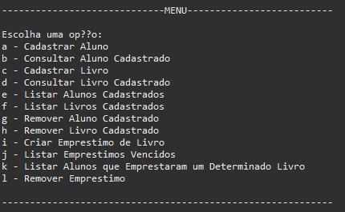

# Sistema Gerenciador de Biblioteca

## ☕ Introdução

Este projeto é um trabalho, que foi realizado na materia de Estrutura de Dados no curso de Analise e Desenvolvimento de Sistemas. Este projeto simula um sistema gerenciador de um biblioteca.

## 💻 Pré-requisitos

Antes de começar, verifique se você atendeu aos seguintes requisitos:

* Você tem uma máquina Windows / Linux / Mac.
* Você tem instalado a versão 8 do JAVA no seu computador ou superior.

[⬆ Voltar ao topo](#Sistema-Gerenciador-de-Biblioteca) 